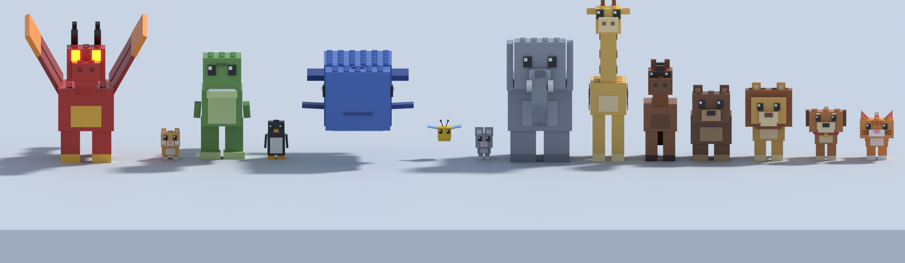
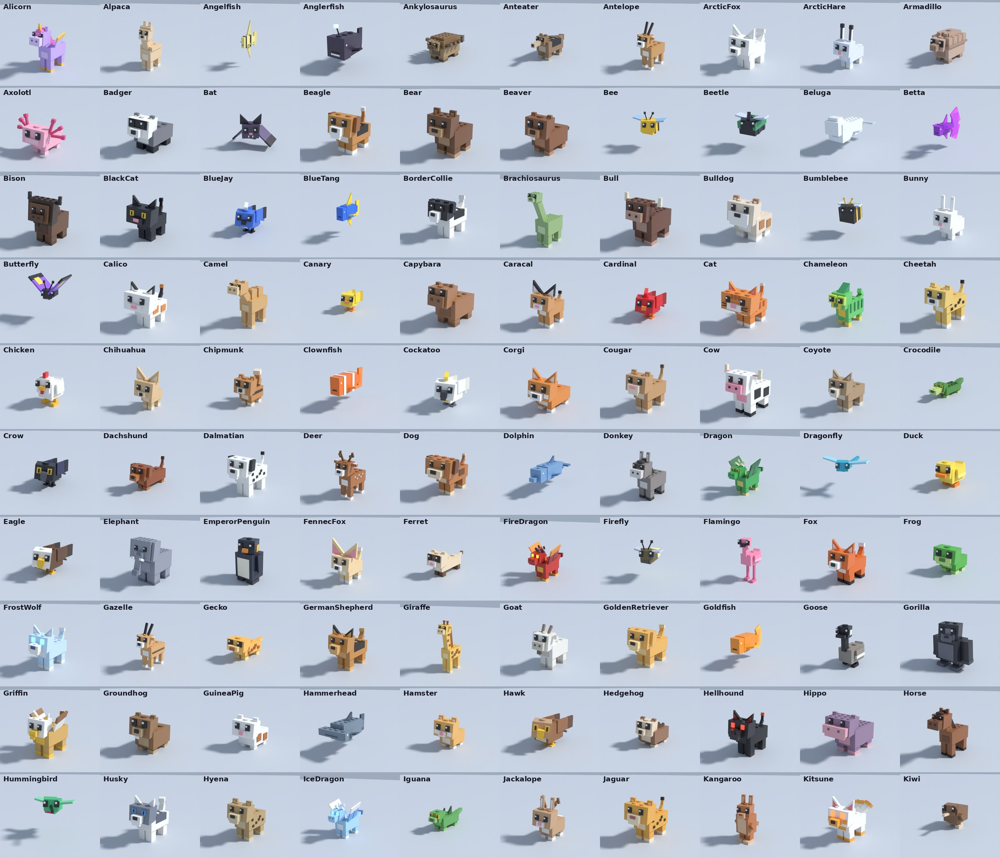
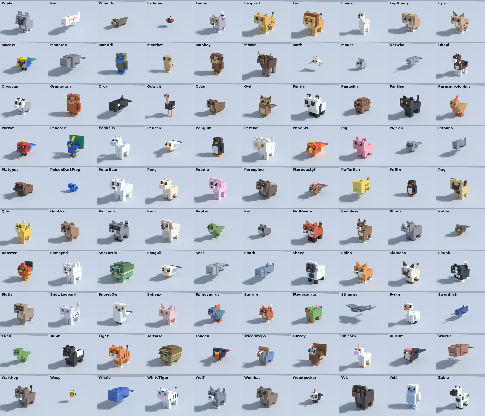
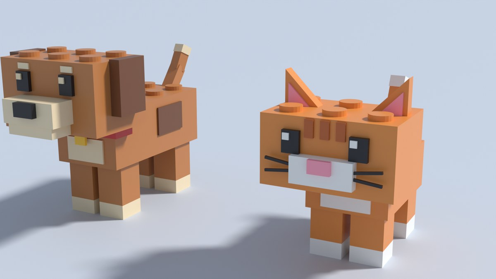
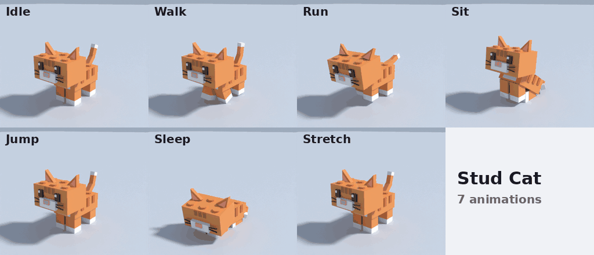
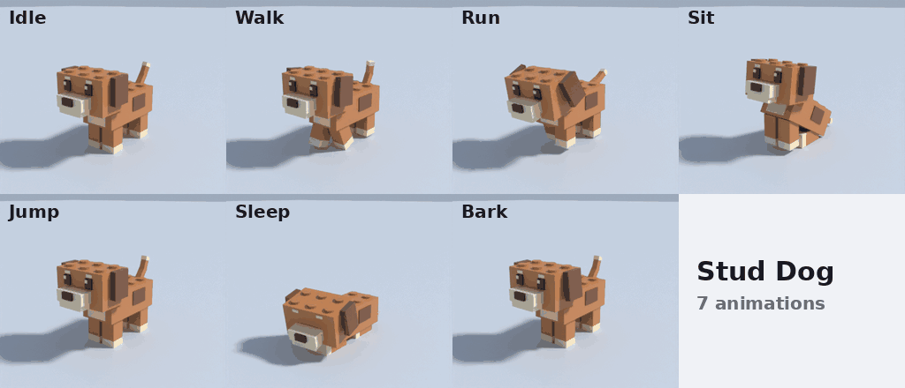

# Stud Pets: 200 blocky Roblox pets

200 blocky, studded Roblox pets built from plain Parts, each with 7 animations that
play **straight from code**. There's nothing to upload, no asset IDs, and nothing to pay.

| Body type | Count | Examples | Animations |
|---|---|---|---|
| Four-legged | 122 | dog & cat breeds, big cats, bears, farm, deer, safari, small mammals, reptiles, dinosaurs, dragons, unicorn/pegasus/griffin/kitsune | Idle, Walk, Run, Sit, Jump, Sleep + trick: Stretch / Roar / Rear / Spin / Trumpet / Bark |
| Flyer | 31 | parrots, owls, hawks, songbirds, bugs, bats, phoenix, pterodactyl | Idle, Walk (fly), Run (fast fly), Sit (perch), Jump (take off), Sleep + Loop |
| Swimmer | 22 | whales, sharks, reef fish, seals, walrus, stingray, sea turtle | Idle, Walk (swim), Run, Sit (drift), Jump (leap), Sleep + Flip / Spin |
| Two-legged | 25 | penguins, poultry, apes, sloth, flamingo, peacock, ostrich, T-rex & other dinos | Idle, Walk (waddle), Run, Sit, Jump, Sleep + Dance / Roar |

The full list is in `src/shared/StudPets/Animals.luau`.

**Sizes are real:** each pet has a size class (`SIZE` table in `Animals.luau`), from bugs at ~0.8×
(the small end is compressed so tiny pets stay readable) to the whale at 2.5×. The rig and all animation offsets scale together (`AnimScale` attribute), and
`Model:ScaleTo()` still works on top. Winged four-legged pets (dragons, pegasus, alicorn, griffin)
have animated wings: folded at rest, flapping when running and jumping, spread when roaring or rearing.

Every pet uses the same animation names, so `anim:Play("Walk")` works on all of them.
To add a pet, add an entry to `src/shared/StudPets/Animals.luau`. That entry sets its size,
colours, ears, tail, markings and trick, then you rebuild.

The detailed table below covers the original Cat & Dog.











| Animation | Cat | Dog | Type |
|---|---|---|---|
| Idle  | breathing, looks around, ear twitch, blinks | same, slow happy wag | loop 4 s |
| Walk  | 4-beat walk, tail up | 4-beat walk, ear bounce | loop 0.7 / 0.8 s |
| Run   | gallop, ears pinned back | gallop, ears flapping | loop 0.42 / 0.46 s |
| Sit   | sits, tail curled round its hip, tail-tip flick | sits, tail sweeping the floor | loop 3 s |
| Jump  | crouch, launch, tuck, land with squash | same | once 1.2 s |
| Sleep | lies down, eyes closed, breathing | same | loop 4 s |
| Trick | **Stretch**: front paws out, rear up, back-leg stretch | **Bark**: two barks, jaw opens, fast wag | once |

## Open it in Studio

- **Quickest:** open `StudPets.rbxl` in Studio and press Play. All 200 pets stand on pedestals
  cycling through their animations, and a small pet follows you around.
  - It walks, runs, sits after 5 s and falls asleep after 12 s, and it jumps when you jump.
  - **G** makes it do its trick. **]** / **[** cycle the follower through all 200.
- **With Rojo:** run `rojo serve` in this folder and connect with the Rojo plugin.
- **Just the models:** drag any file in `assets/pets/` into Studio.
  To animate them you also need the `src/shared/StudPets` modules.

## Use it in your game

```lua
-- LocalScript
local PetAnimator = require(game.ReplicatedStorage.StudPets.PetAnimator)
local pet = game.ReplicatedStorage.StudPetModels.StudCat:Clone()
pet:ScaleTo(0.6)          -- any size works; animations scale with it
pet.Parent = workspace

local anim = PetAnimator.new(pet)
anim:Play("Walk", 0.2, 1.3)   -- name, crossfade seconds, playback speed
anim:Play("Jump")             -- one-shots return to Idle on their own
anim:Play(anim.Set.Trick)     -- each pet's special trick (Stretch, Roar, Loop, Dance...)
-- anim:Destroy()             -- stop animating (automatic when the pet is destroyed)
```

`PetAnimator.new(model, options?)` options:

| Option | Default | Meaning |
|---|---|---|
| `Default` | `"Idle"` | animation to return to after one-shots (Jump, tricks) |
| `AutoStep` | `true` | `false` = call `anim:Step(dt)` yourself |
| `OnFinished` | nil | `function(name)` called when a one-shot ends |
| `PetType` | model's `StudPet` attribute | override the pet type |

Other calls: `anim:IsBusy()` (a one-shot is playing), `anim:GetName()` (current animation),
`PetAnimator.GetTypes()` (all 200 pet type names).

- One animator per model: calling `new` again on the same model replaces the old one.
- Parenting the model to nil pauses it, and it resumes when you parent it back (pooling is fine).
- Models use `ModelStreamingMode = Atomic`, so they work with StreamingEnabled.

- Move the pet with `pet:PivotTo(...)`. Its RootPart is anchored and every other part hangs off it with Motor6D joints.
- All parts are CanCollide / CanQuery / CanTouch off, so they won't block players or raycasts.
- Run the animator on the **client**, since joint transforms are local. Pets further than 250 studs from the camera stop being posed.

## Real Animation assets (optional)

`ServerStorage.StudPetEditorRigs` holds the Cat and Dog with all 7 animations baked
into `AnimSaves` (20 keyframes/s). For all 200, run `lune run build/build.luau editor-all`.
It's left out of the default build to keep the place small.

1. Drag an editor rig into Workspace.
2. Open the Animation Editor, then **Load** an animation.
3. Tweak it, then **Publish to Roblox** (free).

That gives you normal Animation IDs for `Animator:LoadAnimation`.

## How it's built

```
src/shared/StudPets/        runtime (ReplicatedStorage.StudPets)
  AnimLib.luau              easing, curves, blending (pure maths)
  Animals.luau              the 198 kit pets: body measurements, colours, sizes
  QuadrupedAnims.luau       four-legged set + paw planting + tail aiming + wings
  FlyerAnims.luau, SwimmerAnims.luau, BipedAnims.luau   the other three sets
  Pets/Cat.luau, Dog.luau   the two hand-built pets
  PetAnimator.luau          plays them on Motor6D.Transform with crossfades
src/client/PetDemo.client.luau   showcase + follower demo
build/rigs/Kit.luau         builds every Animals.luau pet from its measurements
build/rigs/Cat.luau, Dog.luau    the hand-built rigs
build/build.luau            makes the .rbxm files, bakes AnimSaves, runs QA
build/test_runtime.luau     loads the built place and drives the real PetAnimator
build/render_preview.py     Blender (headless) renders of the exact game poses
build/make_gifs.py, contact_sheet.py, strip_sheet.py, review_sheets.py   preview/review sheets
```

The game, the build, the QA and the preview renders all run the **same animation
modules**, so the previews show exactly what plays in-game.

### Rebuild

Tools, all free:
- [Lune](https://github.com/lune-org/lune) and [Rojo](https://github.com/rojo-rbx/rojo) (`cargo install lune rojo`)
- For previews: `pip install bpy==5.0.1 pillow`

```sh
lune run build/build.luau                    # assets + QA report
rojo build -o StudPets.rbxl
lune run build/test_runtime.luau StudPets.rbxl
# previews
lune run build/build.luau preview /tmp/preview.json
python3 build/render_preview.py /tmp/preview.json /tmp/frames anim
python3 build/make_gifs.py /tmp/frames preview
python3 build/render_preview.py /tmp/preview.json preview hero   # big still
```

The build's QA fails on any of these:
- a paw or tail sinking into the ground
- a pet floating in grounded animations
- a looped animation that doesn't end where it started
- an animation that poses a joint that doesn't exist
- coincident faces that would z-fight
- NaNs

## Known limits

- Built and tested in a cloud session **without Studio**. The models, place file and
  scripts were checked with Lune (same Roblox file format and CFrame maths), but
  nobody has pressed Play in real Studio yet.
- The preview renders draw studs as geometry. Studio draws them as a surface texture,
  so they look slightly flatter in-game.
- The demo follower is local-only; other players don't see it.
- The cat's ear wedges assume Roblox's wedge slope runs down toward the part's front. If
  Studio shows the slope on the inner edge instead, the ears are just mirrored. That's
  cosmetic, and flipping their Y rotation in `build/rigs/Cat.luau` fixes it.
